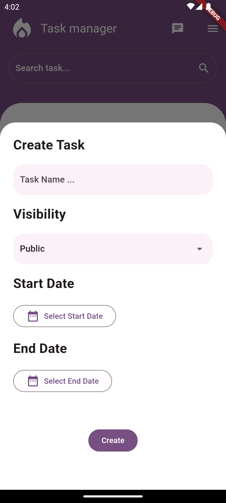

# Task Manager App

## Overview

  Task Manager App là một dự án quản lí công việc cho một cá nhân hoặc một tổ
  chức nhóm người. Giúp cho người dùng quản lí công việc một cách hiệu quả.

## Download App

## Android Screenshots

  

    
Home

    
  

  

    
Navbar Bottom Add

    

  

  

    
Home Drawer

    

  

  

    
List Task

    

  

